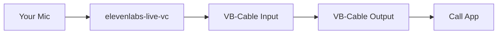

# elevenlabs-live-vc 🎙️

[](https://github.com/cavoq/elevenlabs-live-vc/actions/workflows/build.yml)

```
Live speech to speech bot using Eleven Labs API.

██╗     ██╗██╗   ██╗███████╗    ██╗   ██╗ ██████╗
██║     ██║██║   ██║██╔════╝    ██║   ██║██╔════╝
██║     ██║██║   ██║█████╗█████╗██║   ██║██║
██║     ██║╚██╗ ██╔╝██╔══╝╚════╝╚██╗ ██╔╝██║
███████╗██║ ╚████╔╝ ███████╗     ╚████╔╝ ╚██████╗
╚══════╝╚═╝  ╚═══╝  ╚══════╝      ╚═══╝   ╚═════╝

Description: A live voice-changer utilizing elevenlabs voice-cloning API.
Author: https://github.com/cavoq
```

## Features ✨

- **Real-time Voice Transformation** - Transform your voice using ElevenLabs' AI voice cloning
- **VB-Cable Integration** - Automatically routes transformed audio to VB-Cable for use in calls
- **Two Recording Modes**:
  - **Manual Mode (MODE=0)** - Press SPACE to start/stop recording
  - **Automatic Mode (MODE=1)** - Voice Activity Detection (VAD) auto-detects speech
- **Configurable Audio Settings** - Sample rate, channels, silence threshold, noise reduction

## Use Cases 💡

- Discord voice calls with voice changing
- Zoom/Teams meetings
- WhatsApp calls (via WhatsApp Desktop)
- Streaming with OBS
- Any application that supports microphone input

## Prerequisites 🧰

1. **ElevenLabs Account** - Get your API key from [ElevenLabs](https://elevenlabs.io/app/settings/api-keys)
2. **VB-Cable** - Download and install from [https://vb-audio.com/Cable/](https://vb-audio.com/Cable/)
3. **FFmpeg** - Required for audio processing. Download from [https://ffmpeg.org/download.html](https://ffmpeg.org/download.html)
4. **Python 3.12.x or 3.13.x** (3.13.12 recommended) - Download from [https://python.org](https://python.org)
5. **uv (optional, recommended)** - Install from [https://docs.astral.sh/uv/](https://docs.astral.sh/uv/)

## Installation 📦

### 1. Clone the repository

```bash
git clone https://github.com/cavoq/elevenlabs-live-vc.git
cd elevenlabs-live-vc
```

### 2. Install dependencies

#### Option A: uv (recommended)

```bash
## uv can install Python for you if you don't have 3.13.12 yet
uv python install 3.13.12
uv venv --python 3.13.12
uv sync
```

#### Option B: pip

```bash
pip install -r requirements.txt
```

### 3. Environment Variables

Create a file named `.env` in the root directory:

```env
# Required - Get from https://elevenlabs.io/app/settings/api-keys
API_KEY=your_elevenlabs_api_key_here

# Required - Get from ElevenLabs Voice Lab
# Go to https://elevenlabs.io/app/voice-lab → Select a voice → Copy Voice ID
VOICE_ID=your_voice_id_here

# Optional - Audio settings
SAMPLE_RATE=48000
CHANNELS=1
SILENCE_THRESHOLD=0.01
VAD_THRESHOLD=0.01
REMOVE_BACKGROUND_NOISE=1
OUTPUT_SAMPLE_RATE=48000
API_SAMPLE_RATE=22050
# Optional - audio output selection
# OUTPUT_DEVICE=5
# OUTPUT_DEVICE_NAME=VB-Cable
# Optional - audio input selection
# INPUT_DEVICE=2
# INPUT_DEVICE_NAME=Microphone

# Optional - VAD (Automatic mode)
VAD_SILENCE_DURATION=0.8
VAD_MIN_RECORDING_DURATION=0.3
VAD_PRE_BUFFER_DURATION=0.5

# Optional - Recording mode
# 0 = Manual (press SPACE to record)
# 1 = Automatic (Voice Activity Detection)
MODE=0
```

## Usage ▶️

### Start the Application

#### Option A: uv

```bash
uv run python live-vc.py
```

#### Option B: Python

```bash
python live-vc.py
```

### Manual Mode (Default)

1. Press **SPACE** to start recording
2. Speak into your microphone
3. Press **SPACE** again to stop
4. Wait for processing - transformed voice plays to VB-Cable

### Automatic Mode (VAD)

Enable by setting `MODE=1` in `.env` or typing `set_mode 1` in the app.

1. Just start speaking - recording begins automatically
2. Stop speaking - after a short silence, recording stops
3. Processing happens automatically
4. Cycle repeats - starts listening again after processing

### Commands

| Command | Description |
|---------|-------------|
| `set_mode 0` | Switch to manual mode (press SPACE) |
| `set_mode 1` | Switch to automatic mode (VAD) |
| `get_mode` | Show current mode |
| `clear` | Clear the screen |
| `quit` | Exit the application |

## Using with Call Applications

### Setup for Discord/Zoom/WhatsApp/etc.

1. **Install VB-Cable** if not already installed
2. **Run the voice changer**: `python live-vc.py`
3. **In your call app**, go to Settings → Audio/Voice
4. **Set Microphone/Input** to **"CABLE Output"**
5. Start talking - your transformed voice will be heard by others

### Audio Flow



## Docker 🐳

```bash
docker build -t el-live-vc .
docker run --env-file .env -it --privileged -v /dev/input:/dev/input el-live-vc
```

## Troubleshooting 🛠️

### "No audio recorded" message

- Make sure you're speaking long enough (at least 0.5 seconds)
- Check that your microphone is set as the default Windows input device
- Verify microphone permissions in Windows Settings

### VB-Cable not detected

- Ensure VB-Cable is installed correctly
- The app looks for a device containing "CABLE Input" in the name
- Restart the app after installing VB-Cable

### Voice not heard in call apps
- Make sure you selected **"CABLE Output"** as the microphone in your call app
- Check that VB-Cable is not muted in Windows Sound settings
- Verify the app shows "Done! Audio sent to VB-Cable."

### API Errors

- Verify your API key is correct in `.env`
- Check your ElevenLabs account has available credits
- Ensure the Voice ID exists and you have access to it

## Configuration Options ⚙️

| Environment Variable | Default | Description |
|---------------------|---------|-------------|
| `API_KEY` | (required) | Your ElevenLabs API key |
| `VOICE_ID` | (required) | The voice to transform into |
| `SAMPLE_RATE` | 48000 | Audio sample rate in Hz |
| `CHANNELS` | 1 | Number of audio channels (1=mono) |
| `SILENCE_THRESHOLD` | 0.01 | Silence trim threshold (RMS) |
| `VAD_THRESHOLD` | 0.01 | Voice detection threshold (RMS) |
| `REMOVE_BACKGROUND_NOISE` | 1 | 1=Enable, 0=Disable |
| `OUTPUT_SAMPLE_RATE` | 48000 | Playback device sample rate in Hz |
| `API_SAMPLE_RATE` | 22050 | API output sample rate in Hz (PCM) |
| `OUTPUT_DEVICE` | (optional) | Audio output device index |
| `OUTPUT_DEVICE_NAME` | (optional) | Output device name substring |
| `INPUT_DEVICE` | (optional) | Audio input device index |
| `INPUT_DEVICE_NAME` | (optional) | Input device name substring |
| `VAD_SILENCE_DURATION` | 0.8 | Seconds of silence before auto-stop |
| `VAD_MIN_RECORDING_DURATION` | 0.3 | Minimum recording length in seconds |
| `VAD_PRE_BUFFER_DURATION` | 0.5 | Pre-buffer audio in seconds |
| `MODE` | 0 | 0=Manual, 1=Automatic (VAD) |

## License 📄

GNU General Public License v3.0 - See [LICENSE](LICENSE) for details.

## Credits 🙌

- **Author**: [cavoq](https://github.com/cavoq)
- **Additional Contributors**: [ayeantics](https://github.com/ayeantics)
- **ElevenLabs**: [https://elevenlabs.io](https://elevenlabs.io)
- **VB-Audio**: [https://vb-audio.com](https://vb-audio.com)


